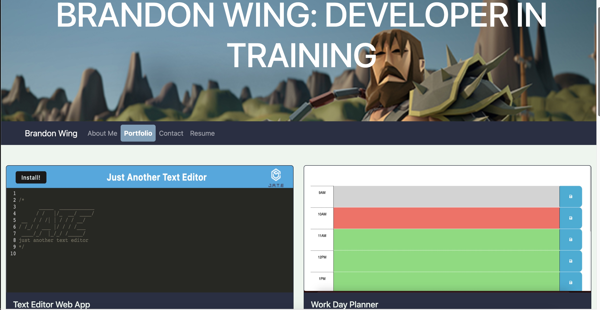

# React Portfolio

This is a single-page application portfolio made using the React Library. The application allows users to view information about me, my projects, view my resume, and contact me.

## Table of Contents

- [Features](#features)
- [Installation](#installation)
- [Usage](#usage)
- [Screenshot](#screenshot)
- [Technologies Used](#technologies-used)
- [Contributing](#contributing)
- [License](#license)

## Features

- A header section with my name and navigation menu for different sections of my portfolio.
- Navigation titles for About Me, Portfolio, Contact, and Resume
- An About Me section with a photo and a short bio.
- A Portfolio section with titled images of six of my apps, with links to both the deployed sites and the GitHub repos.
- A Contact section with a contact form
- A Resume section
- A footer section with links to GitHub, LinkedIn, and twitter.

## Installation

1. Clone the repository from Github
2. Navigate to the root directory and run `npm install` to install dependencies.

OR

view the deployed web application here: 

## Usage

1. Run `npm start` to start the application on your local machine.
2. Open your web browser and navigate to `http://localhost:3000`

## Screenshot

## Technologies Used

- React
- React-bootstrap
- React-icons
- Bootstrap
- HTML
- CSS

## Contributing

No contributions allowed.

